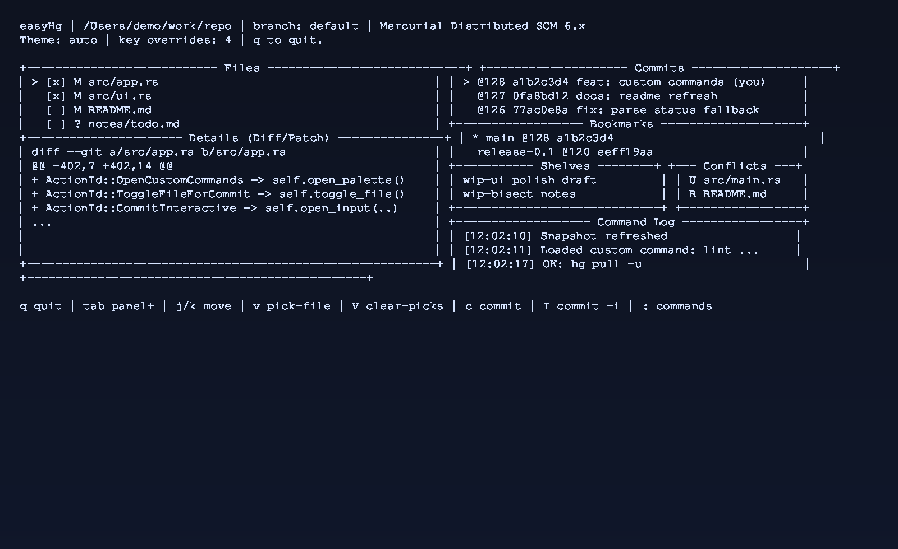
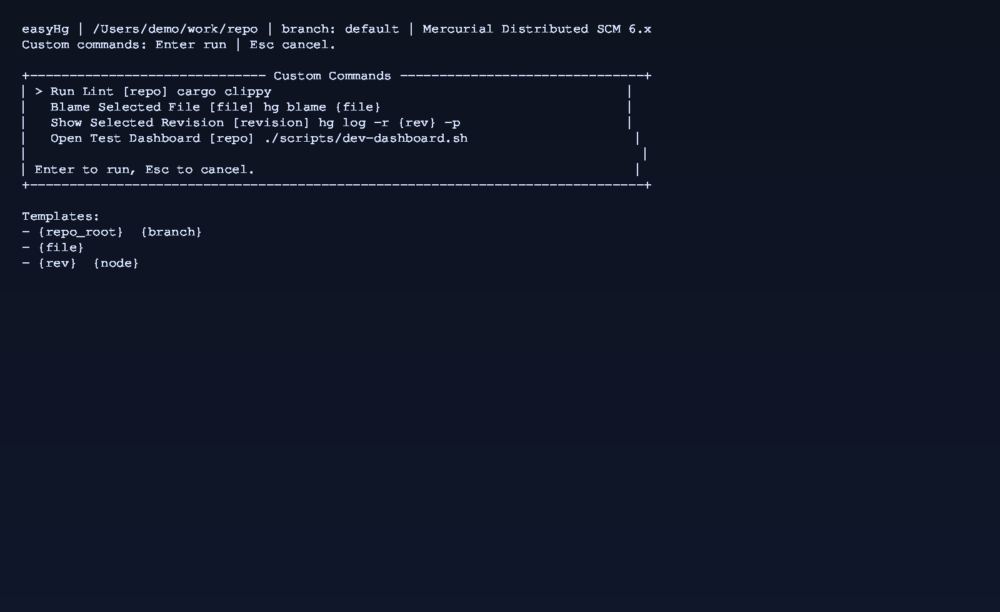
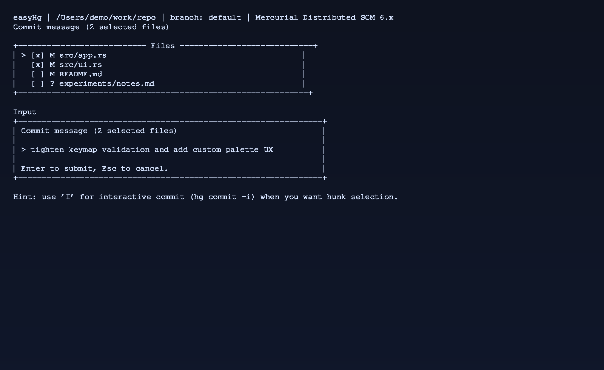

# easyHg

`easyHg` is a keyboard-first terminal UI for Mercurial, inspired by the speed and layout principles of `lazygit`.

It is built for the daily loop: inspect changes, review diffs, make targeted commits, and sync safely.

## Why easyHg

- Fast multi-panel repo visibility (files, details, history, bookmarks, shelves, conflicts, logs)
- Strong safety defaults (confirmations for risky actions)
- Async command execution so the UI stays responsive
- Practical Mercurial-first workflows instead of a Git port

## Core Features

- Live repository snapshot refresh
- File diff and revision patch detail view
- File-level selective commits (choose exactly which files to include)
- Interactive hunk commit flow (`hg commit -i`) without leaving easyHg workflow
- Bookmark, update, shelve/unshelve, incoming/outgoing, pull/push
- Conflict mark/unmark workflow
- Extension-aware history actions (`rebase`, `histedit`)
- Executable custom command palette with context-aware templates
- Non-interactive diagnostics CLI (`--doctor`, `--snapshot-json`, `--check-config`)

## Requirements

- Rust stable toolchain
- Mercurial installed and available as `hg`
- Run inside an existing Mercurial repository
- TTY terminal (raw mode required)

## Quick Start

```bash
cargo run
```

## Screenshots

Overview:



Custom command palette:



Selective commit + commit input:



## CLI

```bash
easyhg --help
easyhg --version
easyhg --doctor
easyhg --snapshot-json
easyhg --check-config
```

## Default Key Workflow

- Navigate panels: `Tab` / `Shift+Tab`
- Move selection: `j/k` or arrow keys
- Refresh snapshot/details: `r`, `d`
- Toggle file for commit: `v`
- Clear selected files: `V`
- Commit: `c`
- Interactive hunk commit: `I`
- Open custom commands: `:`

## Actions

- Commit/bookmark/update/push/pull
- Incoming/outgoing
- Shelve create + unshelve selected shelf
- Resolve mark/unmark
- Rebase and histedit (only when supported by current repo setup)

## Custom Commands

Custom commands are opened from the palette (`:` by default), can require confirmation, and can show command output in the Details panel.

Config fields per command:

- `id`: unique identifier
- `title`: display name
- `context`: `repo`, `file`, or `revision`
- `command`: executable and optional inline args
- `args`: optional additional args
- `env`: optional environment variables
- `show_output`: if true, render stdout/stderr in Details after success
- `needs_confirmation`: if true, show confirmation modal before run

Template variables available in `command`, `args`, and `env` values:

- `{repo_root}`
- `{branch}`
- `{file}` (when a file is selected)
- `{rev}`, `{node}` (when a revision is selected)

## Configuration

Config path:

`~/.config/easyhg/config.toml`

Example:

```toml
theme = "auto"

[keybinds]
commit = "C"
refresh_snapshot = "ctrl+r"
open_custom_commands = ":"
toggle_file_for_commit = "v"
clear_file_selection = "V"
commit_interactive = "I"

[[custom_commands]]
id = "lint"
title = "Run Lint"
context = "repo"
command = "cargo clippy"
args = ["--all-targets"]
show_output = true
needs_confirmation = true

[[custom_commands]]
id = "blame-file"
title = "Blame Selected File"
context = "file"
command = "hg"
args = ["blame", "{file}"]
show_output = true
needs_confirmation = false

[[custom_commands]]
id = "show-rev"
title = "Show Selected Revision"
context = "revision"
command = "hg"
args = ["log", "-r", "{rev}", "-p"]
show_output = true
needs_confirmation = false
```

Supported keybinding action IDs:

- `quit`
- `help`
- `focus_next`
- `focus_prev`
- `move_down`
- `move_up`
- `refresh_snapshot`
- `refresh_details`
- `open_custom_commands`
- `toggle_file_for_commit`
- `clear_file_selection`
- `commit`
- `commit_interactive`
- `bookmark`
- `shelve`
- `push`
- `pull`
- `incoming`
- `outgoing`
- `update_selected`
- `unshelve_selected`
- `resolve_mark`
- `resolve_unmark`
- `rebase_selected`
- `histedit_selected`
- `hard_refresh`

## Development

```bash
cargo fmt
cargo test
```

## Homebrew Distribution

- Source-to-tap formula bump workflow and helper script live in:
  - `.github/workflows/update-homebrew-tap-formula.yml`
  - `scripts/update-homebrew-tap-formula.sh`
- Tap bottle workflow template and setup notes live in:
  - `packaging/homebrew/README.md`
  - `packaging/homebrew/tap-workflows/publish-bottles.yml`

Current automated coverage includes:

- parser and behavior unit tests
- UI interaction tests
- CLI integration tests (`--snapshot-json`, `--check-config`)

## Architecture

- `src/main.rs`: startup + CLI modes
- `src/app.rs`: state machine, key handling, async action wiring
- `src/ui.rs`: panel and modal rendering
- `src/hg/mod.rs`: Mercurial adapter + parsing + command execution
- `src/config.rs`: config schema + load/validation
- `src/domain.rs`: typed domain models
- `src/actions.rs`: typed action IDs + keymap parsing/defaults

## Roadmap

- Broader integration test matrix with temporary hg repos
- More guided conflict/history-edit workflows
- Packaging and distribution polish
